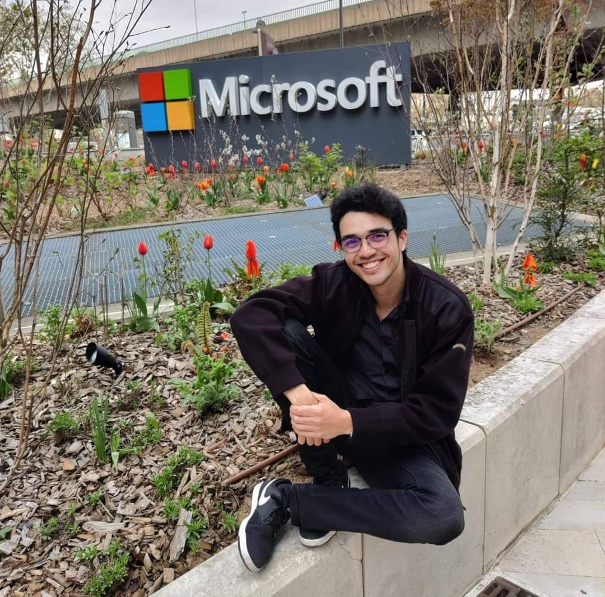
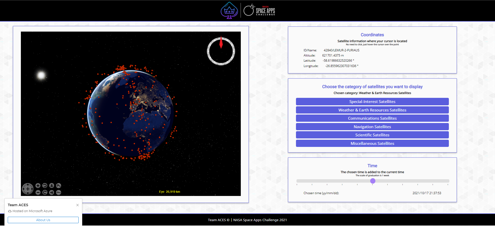
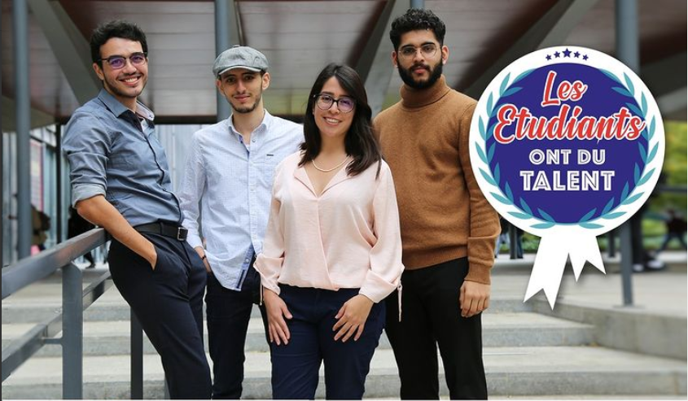
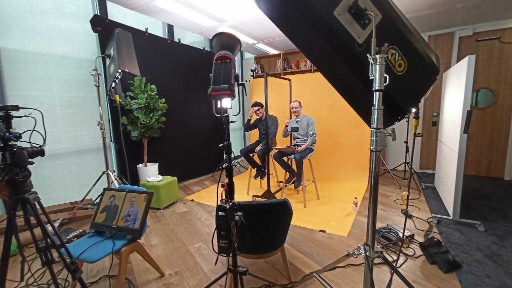
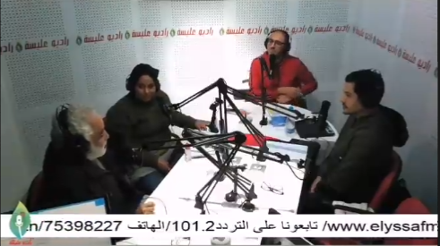

### Hi there 👋

  
  
  

- 📫 How to reach me: 

     
     
     

- :trophy: Latest achievements:

  [NASA Space Apps Challenge](https://www.spaceappschallenge.org/) Winner in France. Project : Eye Above a 3D real time space debris mapper and predictor of satellites trajectories to avoid accidents.
  
   
   
  
  [ImagineCup](https://imaginecup.microsoft.com/en-us/Events) Winner in Switzerland, World Cup Semi-finalist. Project: Lumen an assistant for the visually impaired.
  
  [Youtube Video](https://www.youtube.com/watch?v=dF65xZh1xRg)
  
  
  
  Co-Developed [Blico](https://github.com/nodiz/Blico) for [Lauzhack](https://lauzhack.com/)2020 - Winner of the [SBB challenge](https://devpost.com/software/blinddetector)
  
  [YouTube video](https://www.youtube.com/watch?v=M2HeJXddtcc)

  
  

  
  
- :radio: Podcasts, Videos and Articles i appeared in :

   [Article](https://www.instagram.com/p/CVni3RRIlo-/) by Sorbonne Université about our project in the NASA Challenge 2021 (French): 
   
   
   
   [Interview](https://www.linkedin.com/in/achrafjday/detail/treasury/position:1718962834/?entityUrn=urn%3Ali%3Afsd_profileTreasuryMedia%3A(ACoAACHLV4wBf9UHXrghJ3Ki6TnmKVWnuVoA82Q%2C1635467282830)&section=position%3A1718962834&treasuryCount=8) by Microsoft for their Student Ambassador's promotional video in Microsoft Paris HQ (French): 
   
   &section=position%3A1718962834&treasuryCount=8)

   Hear me talk about AI, Cybersec and my projects in this episode of a [podcast](https://open.spotify.com/episode/2ZMDOhMdnxBKyuFK7HjTDs?si=Deb88VpgT5iYQmHI2jonSA) that i was invited to (English):  

   
   
   My project [Lumen](https://github.com/nodiz/Blico) was talked about on [Radio](https://elyssafm.tn/) and on [TV](https://www.youtube.com/watch?v=9znfHD4dlOI) (at 7:30 in the video) (Arabic): 
   
   
   

   
 
- Here are my projects based on their type (Teaching material, University work, Hobby&Competition).
  
| Teaching Material | Description |
| ------------- | ------------- |
| [Workshops Collection](https://github.com/Achraf99Jday/Workshops)  | A collection of some of the workshops i hosted |
| [RoadToAI](https://github.com/Achraf99Jday/RoadToAI-Series)  | Teaching AI from the very development and maths basics to machine learning algorithms |
| [Statistics&Probability for Data Science](https://github.com/TeoBernier/Stats_Info)  | Notebooks to help you explore the mathematical basics of statistical learning (French)  |
| [CTF SorbonneU](https://github.com/baskiotisn/CTF-SU/wiki)  | A wiki for our CTF events that we are hosting in our university, great starting point for computer security and hacking (French)  |

| Hobby&Competition  | Description |
| ------------- | ------------- |
| [Eye Above](https://github.com/Achraf99Jday/ACES-NASA)  | Mapping Space Trash in Real Time, Winner of [Nasa Space Apps Challenge 2021](https://2021.spaceappschallenge.org/challenges/statements/mapping-space-trash-in-real-time/teams/aces-1/project) in France |
| [Lumen](https://github.com/nodiz/Lumen)  | AI companion for people with visual impairments for train stations and metros navigations, winner of [Lauzhack2020](https://devpost.com/software/blinddetector) and now adopted by [SBB The Swiss National Railway Company](https://www.sbb.ch/en/timetable/mobile-apps/sbb-inclusive.html) |
| [Match Game Azure Bot](https://github.com/Achraf99Jday/Match-Game-Azure-Bot)  | Bot for the match game on [aigaming.com](https://www.aigaming.com/) using the Computer Vision Azure API.  |
| [Quantum Computing](https://github.com/Achraf99Jday/Quantum-Computing)  | My notebooks from MIT's IBM Quantum Computing course |
| [Space Rocks Classifier](https://github.com/Achraf99Jday/Space-Rocks-Classifier)  | A space rocks classifier built with pyTorch  |
| [Facebook OSINT and Bot](https://github.com/Achraf99Jday/Bot-n-Osint)  | Facebook OSINT tool equipped with a react/comment/add/etc Bot.  |
| [HXP CTF](https://github.com/Achraf99Jday/HxP-CTF-2020)  | Solutions to some HXP2020 challenges  |
| [DeltaShapes](https://github.com/Achraf99Jday/DeltaShapes)  | DeltaShapes is a highly addictive, fun and competitive match 3 game  |
| [AI.cam](https://github.com/Achraf99Jday/AI.cam)  | A basic sign language translator made during a hackathon  |
| [JuypterMerger](https://github.com/Achraf99Jday/JupyterMerger) | A program that merges multiple Jupyter Notebooks into one. |
| [AMV Bot](https://github.com/Achraf99Jday/AMVBot)  | A Bot that generates Anime Music Videos based on an input video and music |
| [Tinder Bot](https://github.com/Achraf99Jday/TinderBot)  | A bot that swipes either left or right on a person based on your input preferences.  |
| [StatLog](https://github.com/Achraf99Jday/StatLog)  | A keylogger that runs statistics on your usage. |

| University Work  | Description |
| ------------- | ------------- |
Master's Degree:
1st year:
| [Logic and Knowledge Representation](https://github.com/Achraf99Jday/Logic-and-Knowledge-Representation) | Writing in Prolog of a demonstrator based on the decision procedure of the tables algorithm for the ALC description logic |
| [You Are The Hero](https://github.com/MinaYuni/il-projet) | An interactive book game where you decide every action and influence the story |
Bachelor's Degree:
3rd Year:
| [Genetic and Breitenberg AI Multi-Agent](https://github.com/Achraf99Jday/PaintWars-AI-Multi-Agent-Genetic-and-Breitenberg-Algorithms) | Genetic and Breitenberg AI algorithms for a Multi-Agent PaintWars game |
| [NLP + Recommendation System](https://github.com/Achraf99Jday/RecommendationAlgorithm)  | Researching and applying AI for recommendation systems, NLP on tv series subtitles  |
| [Multi-Agent Reinforcement Learning](https://github.com/Achraf99Jday/MultiAgentAI) | An adversary cooperative multi-agent pathfinding algorithms for 2D platformer game solving |
| [Machine Learning Google Play Store](https://github.com/Achraf99Jday/Machine-Learning-Google-Play-Store) | Supervised and unsupervised approach to analysing and predicting various data in the google play store datsets |
| [Machine Learning Indian Liver Patients](https://github.com/Achraf99Jday/MachineLearning-Indian-Liver-Patient) | ML algorithms applied on an indian liver patients dataset|
| [Gale-Shapley Alrogithm Optimization](https://github.com/Achraf99Jday/GaleShapley-Optimization) | LP and optimization on the GS algo for an affectation problem |
| [Epidemiology Markov Chains](https://github.com/Achraf99Jday/Epidemiology-Markov-Chains)| Manipulation of Markov chains to study the propagation of an epidemic in a population.  |
| [Machile_Learning_Heart_Disease_Detection](https://github.com/Achraf99Jday/Machile_Learning_Heart_Disease_Detection)  | Study the classification methods to which statistics naturally give access. It will therefore be a question of studying probabilistic classification tools.  |
| [BattleshipAI](https://github.com/Achraf99Jday/BattleshipAI)  | Study the game of naval battle from a probabilistic point of view  |
| [Off-Shark](https://github.com/Achraf99Jday/Off_Shark)  | An Offline Networks Protocoles Analyser  |
2nd year:
| [GoPiGo3](https://github.com/XeelS/gopigo3_gazebo-ros)  | Simulation of a GoPiGo3 using Gazebo and real-world operation using ROS  |
| [SokoAI](https://github.com/Achraf99Jday/SokoAI)  | In this game you can either move the character using the keyboard arrows or choose the AI option to observe how the automated character solves the problem by itself using the Djikstra's algorithm and it's variants.  |
| [JavaBrowser](https://github.com/tripincloud/Java_Browser)  | Implementation of a "Google" type search engine that allows us to retrieve documents in response to a request.  |
| [FloodIt](https://github.com/Achraf99Jday/FloodIt-Graph-Theory)  |  Graph Theory take on the FloodIt game.  |
| [Music Library](MusicLibrary-DataStructures)  |  A music library built with advanced C data structures. |
| [Javaman](https://github.com/Achraf99Jday/Javaman)  | A Pacman game.  |
| [Automata-Theory](Automata-Theory)  | Algorithms for Deterministic finite automatas (DFA) and Non deterministic finite automatas (NFA).  |
| [Ecosystem](https://github.com/Achraf99Jday/Ecosystem) | An irrealistic take on a natural ecosystem and its evolution. |
| [Ocaml.io](https://github.com/Achraf99Jday/Ocaml.io)  | An Agario game built entirely on a functional programming basis.  |
| [SillyRobots](https://github.com/Achraf99Jday/SillyRobots)  | A simulation of a variable based environment of polluting robots and their counterparts the cleaners.  |
1st year: 
| [OthelloAI](https://github.com/Achraf99Jday/MinMaxOthello)  | An algorithm that solves the Othello game.  |

<!--
- 🔭 I’m currently working on ...
- 🌱 I’m currently learning ...
- 👯 I’m looking to collaborate on ...
- 🤔 I’m looking for help with ...
- 💬 Ask me about ...
- 😄 Pronouns: ...
-->
